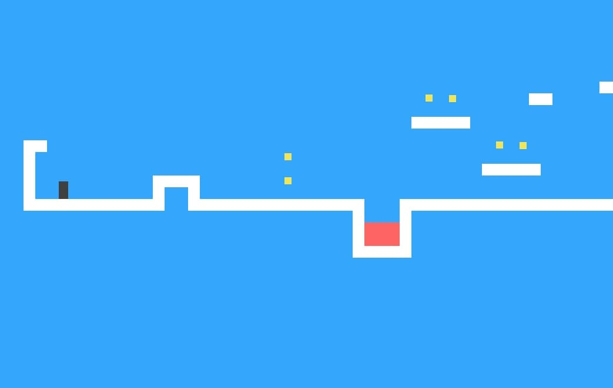
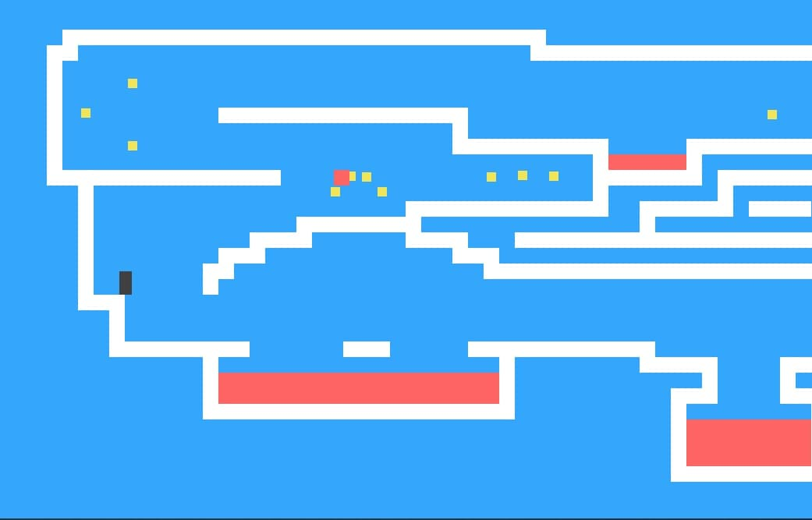

## About <a href="https://bayramooov.github.io/platform-game/"><b>Bayramooov.github.io/platform-game</b></a>

Platform-game is an old fashioned game which is build just for fun & practise.
Platform games are a video game genre and subgenre of action games. Platformers are characterized by their heavy use of jumping and climbing to navigate the player's environment and reach their goal.
- Simple
- Interesting
- User-friendly
- Open source

PS: you can steal / fork / copy / clone / develop..., it is fully open-source project for general learning!
it's not fully finished yet, let's make it challenge for everyone who is curious about 2D/3D Graphics. You can create skins for the player, or you can add new features such as shooting or killing enemies.

## Techieland

**Techieland** is our teamname who creates software solutions for businesses.
